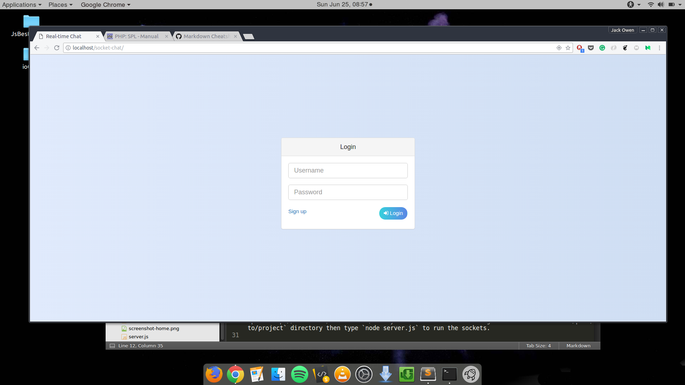
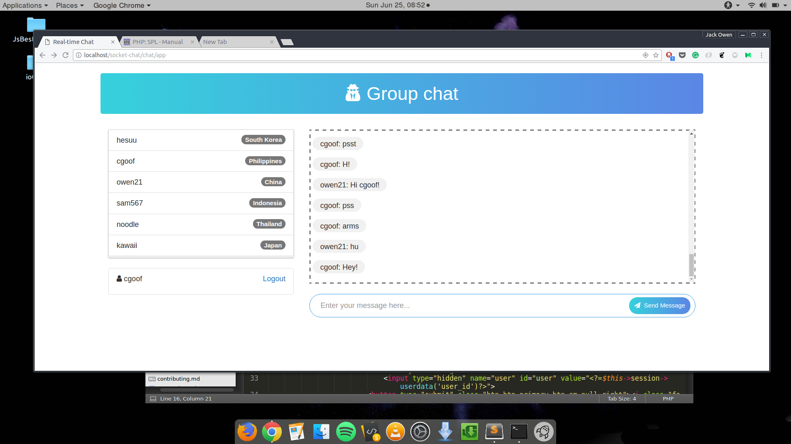

# Real-time Group Chat with Geolocation
A chat application implementing Web sockets in CodeIgniter.

## Features
To join the group chat you must create an account(just username & password) first. Then after you logged in, all 
online users will appear to the page inlcuding their respective locations (using Geolocations and Google Maps API) and the chat thread.    
Note: Make sure that you allow your location in your browser.


##Screenshots
Login
*** 



Home Page
***

   

## NodeJS modules
[Request](https://www.npmjs.com/package/request)  
[Express](https://www.npmjs.com/package/express)  
[socket.io](https://www.npmjs.com/package/socket.io)  
Install:
```javascript
  npm install *module* --save
```

## Caveat
1. Some of the components are CDNs and needs internet connection.
2. Apache uses `port 80 or 8080` but the socket doesn't work with that due to security measures of Linux file system (I don't know if windows works with that). I used `port 3000` in order to work but you need to redirect the default port of apache to port 3000 by issuing: `sudo iptables -t nat -A PREROUTING -i eth0 -p tcp --dport 80 -j REDIRECT --to-port 3000` in Linux terminal.
3. Import that SQL file, and update the database config from the project.
4. Database is full of random texts (dummy contents).

## Usage
Open `http://localhost/socket-chat/` to your favorite browser then got to terminal and `cd /path/to/project` directory then type `node server.js` to run the sockets.
